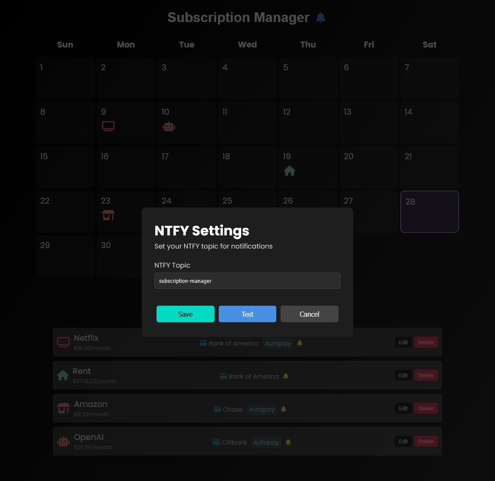
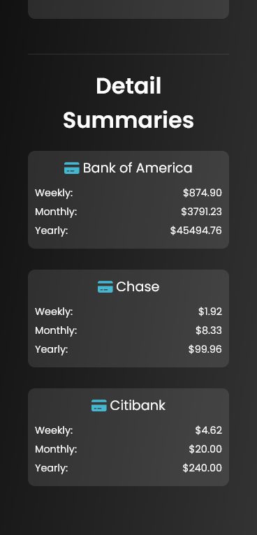

# Subscription Manager

This web application lets you keep track of and manage your subscriptions. You can add, edit, delete, and view subscriptions. You can set up notifications for each subscription using NTFY. There is a general summary of all your subscriptions and a detailed summary for each payment account.

## Video Demo

<p align="center">
  <a href="https://www.youtube.com/watch?v=tAL8Gv35mKw">
    
  </a>
</p>

## Screenshots
<p align="center">
  
</p>
<p align="center"><em>Main dashboard</em></p>

<p align="center">
  
</p>
<p align="center"><em>Add/Edit subscription form</em></p>

<p align="center">
  
</p>
<p align="center"><em>Notification settings</em></p>

<p align="center">
  
  
  
</p>
<p align="center"><em>Mobile interface</em></p>


## Features

- Add, edit, and delete subscriptions
- View subscriptions on a calendar
- Calculate weekly, monthly, and yearly totals
- Detailed summaries per payment account
- Customizable icons and colors for each subscription
- Notification system integration with NTFY

## Tech Stack

- React
- Express
- SQLite
- Font Awesome

## Setup

### Docker Compose

1. Clone the repository
2. Make sure you have Docker and Docker Compose installed
3. Run the following command in the project root:
   ```
   docker-compose up --build
   ```
4. The app will be available at `http://localhost:3000`

### Manual Setup

1. Clone the repository
2. Install dependencies: `npm install`
3. Create `subscriptions.db` file in the `server` directory
4. Run the app: `npm run dev`

## Adding Icons

This app uses Font Awesome icons. To add an icon to your subscription, use the icon name from the [Font Awesome icon library](https://fontawesome.com/icons).

## Notifications

The app integrates with NTFY for sending notifications. To set up notifications:

1. Click the bell icon next to the app title
2. Enter your NTFY topic
3. Save the settings

You'll receive notifications for upcoming subscription payments.

Enjoy 🎉!
